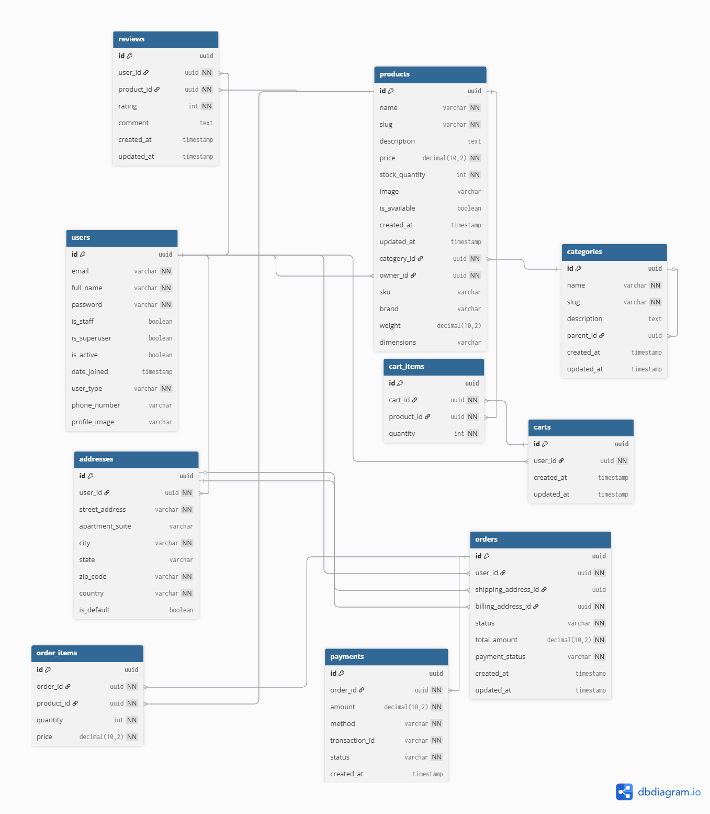

# alx-project-nexus: ProDev Backend Engineering Learnings Documentation

## Table of Contents
*   [Introduction to ProDev Backend Engineering Program](#introduction-to-prodev-backend-engineering-program)
*   [Key Technologies Covered](#key-technologies-covered)
    *   [Python](#python)
    *   [Django](#django)
    *   [REST APIs (Django REST Framework)](#rest-apis-django-rest-framework)
    *   [GraphQL APIs](#graphql-apis)
    *   [Docker](#docker)
    *   [CI/CD (GitHub Actions)](#cicd-github-actions)
    *   [Celery & RabbitMQ](#celery--rabbitmq)
*   [Important Backend Development Concepts](#important-backend-development-concepts)
    *   [Database Design & Optimization (PostgreSQL)](#database-design--optimization-postgresql)
    *   [Asynchronous Programming](#asynchronous-programming)
    *   [Caching Strategies](#caching-strategies)
    *   [System Design & Scalable Architecture](#system-design--scalable-architecture)
    *   [Authentication & Authorization](#authentication--authorization)
*   [Challenges Faced & Solutions Implemented](#challenges-faced--solutions-implemented)
*   [Best Practices & Personal Takeaways](#best-practices--personal-takeaways)
*   [Collaboration & Project Management Tools](#collaboration--project-management-tools)
*   [Conclusion](#conclusion)

---

## Introduction to ProDev Backend Engineering Program
This repository, `alx-project-nexus`, is a comprehensive documentation hub for my major learnings throughout the ProDev Backend Engineering program. It consolidates key concepts, technologies, challenges, and solutions encountered, demonstrating my understanding and application of backend development principles. This project also functions as a personal reference guide and a testament to the skills acquired.

## Key Technologies Covered
### Python
*   **Overview:** Python's versatility, readability, and extensive ecosystem, especially with frameworks like Django, make it an indispensable language for building robust and scalable backend systems. Its clear syntax and vast community support significantly streamline the development process.
*   **Key Learnings:** I gained proficiency in managing virtual environments (`venv`, `pipenv`), effectively handling package dependencies with `pip`, and deepening my understanding of fundamental data structures (lists, dictionaries, sets). I also strengthened my knowledge of Object-Oriented Programming (OOP) principles, learned to use decorators and context managers effectively, and implemented robust error handling mechanisms.

### Django
*   **Overview:** Django is a "batteries-included" high-level Python web framework that promotes rapid development and clean, pragmatic design. It handles much of the boilerplate, allowing developers to focus on application logic.
*   **Key Learnings:** I mastered the MVT (Model-View-Template) architectural pattern, learning to leverage Django's powerful ORM (Object-Relational Mapper) for seamless database interactions. I became adept at managing database schema changes using migrations, customizing and extending the Django Admin Interface for backend management, and developing robust forms for data input and validation.

### REST APIs (Django REST Framework)
*   **Overview:** RESTful APIs provide a standardized, stateless, client-server communication method over HTTP, and Django REST Framework (DRF) significantly simplifies their creation and implementation within a Django project.
*   **Key Learnings:** My focus was on designing clear and intuitive API endpoints, implementing serializers for efficient data validation and representation, and utilizing class-based views (specifically `APIView`, `Generic Views`, and `ViewSets`) for building efficient and maintainable API logic. I also learned to configure various authentication schemes (e.g., Token, Session), set appropriate permissions (`IsAuthenticated`, `IsAdminUser`), and implement pagination and filtering for handling large datasets.

### GraphQL APIs
*   **Overview:** GraphQL is a powerful query language for APIs and a runtime for fulfilling those queries with existing data. It allows clients to request exactly the data they need, improving efficiency and reducing over-fetching compared to traditional REST APIs.
*   **Key Learnings:** I learned to define precise schemas with strong typing for data types and fields, write complex queries to fetch specific data tailored to client needs, and craft mutations for safe and controlled data manipulation. I also explored how subscriptions enable real-time updates and understood the significant advantages GraphQL offers for applications with complex and evolving data requirements.

### Docker
*   **Overview:** Docker enables containerization, a process of packaging applications and their dependencies into isolated, portable units called containers. This ensures consistent environments across development, testing, and production.
*   **Key Learnings:** I became proficient in writing `Dockerfiles` to define and build custom images for my applications. I learned to manage and run individual containers, and crucially, how to orchestrate multi-service applications (like a Django app with PostgreSQL and Redis) using `docker-compose.yml`. I gained a solid understanding of Docker volumes for persistent data storage and how to configure networks for seamless inter-container communication.

### CI/CD (GitHub Actions)
*   **Overview:** Continuous Integration (CI) and Continuous Deployment/Delivery (CD) are practices that automate the building, testing, and deployment of code changes, leading to faster, more reliable, and more frequent software releases. GitHub Actions provide an integrated way to implement these pipelines.
*   **Key Learnings:** I learned to set up GitHub Actions workflows to automate various stages of my development pipeline. This included automated unit and integration testing, code linting, building Docker images, and deploying applications to different environments (e.g., staging, production) upon code pushes or successful pull request merges, significantly improving my development workflow efficiency.

### Celery & RabbitMQ
*   **Overview:** Celery is a robust distributed task queue that allows for the asynchronous execution of long-running or resource-intensive tasks, preventing blocking operations in the main application thread. RabbitMQ often serves as the message broker, facilitating communication between the application and Celery workers.
*   **Key Learnings:** I learned to define and register tasks within my Django applications, push these tasks to queues, and configure Celery workers to process them in the background. I gained an understanding of how to monitor task status and the critical role of message brokers in decoupling processes, thereby improving application responsiveness and overall scalability.

## Important Backend Development Concepts
### Database Design & Optimization (PostgreSQL)
*   **Overview:** A well-structured database is absolutely fundamental for ensuring data integrity, optimizing data retrieval efficiency, and ultimately boosting application performance. PostgreSQL served as our powerful, open-source relational database system.
*   **Key Learnings:** I deeply engaged with applying normalization principles (1NF, 2NF, 3NF) to achieve data consistency and minimize redundancy. I learned to design efficient schemas with appropriate data types and relationships, create and manage indexes for significantly faster query execution, and write optimized SQL queries. Furthermore, I understood the importance of transactions for maintaining data integrity and explored PostgreSQL-specific features like JSONB for flexible data storage.

### Asynchronous Programming
*   **Overview:** Asynchronous programming allows certain operations to run independently of the main program flow. This is crucial for preventing the application from blocking during I/O-bound or time-consuming tasks, thereby improving overall responsiveness and user experience.
*   **Key Learnings:** I grasped the core concepts of non-blocking I/O and event loops. I extensively applied asynchronous patterns in Python, particularly in the context of integrating Celery for background tasks, to offload long-running operations and ensure the main application thread remains responsive.

### Caching Strategies
*   **Overview:** Caching is a vital technique for improving application performance and scalability by storing frequently accessed data in faster, temporary storage. This significantly reduces the load on the primary database and speeds up response times for repeated requests.
*   **Key Learnings:** I implemented various caching levels, from in-memory caching using Django's built-in cache framework to distributed caching solutions with Redis. I learned to select appropriate caching mechanisms based on data volatility and access patterns, designed effective cache invalidation strategies (e.g., time-based expiration, event-driven invalidation), and understood the critical trade-offs between cache freshness and performance gains.

### System Design & Scalable Architecture
*   **Overview:** System design involves meticulously planning the architecture of a software system to meet critical functional and non-functional requirements, such as scalability, reliability, maintainability, and performance.
*   **Key Learnings:** I gained insights into differentiating between monolithic and microservices architectures, understanding their respective advantages and disadvantages. I learned principles for designing systems that can scale both horizontally and vertically, implemented load balancing strategies, and incorporated message queues for robust inter-service communication and efficient task distribution. My understanding also expanded to designing for fault tolerance, resilience, and patterns like API Gateways.

### Authentication & Authorization
*   **Overview:** Authentication is the process of verifying a user's identity ("Who are you?"), while authorization determines what actions an authenticated user is permitted to perform ("What can you do?"). Both are paramount for securing any application.
*   **Key Learnings:** I implemented various authentication methods, including JSON Web Tokens (JWT) for stateless APIs, session-based authentication for traditional web applications, and explored concepts of OAuth2. I focused on designing robust authorization systems using roles and permissions, and deeply engaged with security best practices such as secure password hashing, comprehensive input validation, and protecting sensitive data from common web vulnerabilities.

## Challenges Faced & Solutions Implemented

### Challenge: Optimizing N+1 Query Problem in Django REST Framework
**Problem:** During the development of a specific API endpoint, I observed significant performance degradation due to the "N+1 query problem," where retrieving a list of objects also triggered N additional database queries to fetch related data for each object

**Approach:** I first identified the N+1 queries using Django Debug Toolbar. I then researched Django ORM's `select_related()` and `prefetch_related()` methods, understanding their differences and appropriate use cases for one-to-one/many-to-one and many-to-many/many-to-one relationships, respectively.

**Solution:** By applying `select_related()` to eagerly load foreign key relationships and `prefetch_related()` for many-to-many relationships in my `queryset` within the DRF view, I reduced the number of database queries from N+1 to a fixed, minimal number (e.g., 2).

**Learnings:** This experience reinforced the importance of monitoring database queries and leveraging Django ORM's powerful optimization tools to prevent performance bottlenecks.

### Challenge: Implementing Robust Background Task Management with Celery
**Problem:** I needed to offload time-consuming operations, like sending emails or processing large data files, from the main request-response cycle to improve API responsiveness. Initially, these tasks were blocking, leading to slow user experiences

**Approach:** I researched distributed task queues and identified Celery with RabbitMQ as a suitable solution. My approach involved understanding Celery's architecture (broker, worker, client), defining tasks, and integrating them correctly into my Django application. I considered error handling and task retry mechanisms.

**Solution:** I successfully integrated Celery and RabbitMQ, defining specific tasks for email notifications and data processing. I configured Celery workers to run continuously, consuming tasks from the RabbitMQ queue. I implemented error handling for failed tasks, including automatic retries, and ensured task status could be monitored.

**Learnings:** This challenge taught me the immense value of asynchronous processing for improving application scalability and user experience. I learned the intricacies of configuring and monitoring a distributed task queue system, understanding how to effectively decouple operations and build more resilient backend systems.

## Best Practices & Personal Takeaways
*   **Code Quality:** My commitment to writing clean, readable, modular, and well-commented code was paramount. I routinely utilized linters (e.g., `flake8`) and formatters (e.g., `Black`) to maintain consistent code style. I embraced Test-Driven Development (TDD) principles by writing unit and integration tests to ensure code reliability and prevent regressions, which significantly improved code confidence.
*   **Version Control:** I became proficient in effective GitHub usage for version control. This involved adhering to clear and descriptive commit message conventions, maintaining distinct feature branches for development, and actively participating in code reviews to ensure code quality and foster collaborative development.
*   **API Documentation:** I recognized the critical importance of clear, accurate, and up-to-date API documentation. I leveraged tools like Swagger/OpenAPI to automatically generate interactive documentation directly from my Django REST Framework endpoints, which greatly facilitated seamless integration for frontend teams and external consumers.
*   **Security:** I prioritized implementing robust security considerations throughout development. This included rigorous input validation, proper user authentication and authorization mechanisms, protecting against common web vulnerabilities (e.g., CSRF, XSS), and handling sensitive data securely. I also explored rate limiting to prevent API abuse and brute-force attacks.
*   **Personal Growth:** This program significantly enhanced my problem-solving abilities, honed my critical thinking in architecting scalable backend systems, and strengthened my capacity to quickly learn and adapt to new technologies. I grew not only as a developer but also in understanding the full lifecycle of a backend application, from conception to deployment and maintenance.

## Collaboration & Project Management Tools
*   **Trello/Notion:** These tools were instrumental for organizing my tasks, setting clear milestones, tracking progress, and managing both my individual and team workflows efficiently. They provided excellent visual aids for understanding project scope and dependencies.
*   **Google Meet/Zoom:** Regularly scheduled virtual meetings fostered effective team discussions, facilitated collaborative problem-solving sessions, and maintained strong communication channels throughout all collaborative projects.
*   **Discord:** The dedicated Discord channels, particularly `#ProDevProjectNexus`, were invaluable hubs for exchanging ideas with both frontend and backend learners. They served as quick platforms for asking questions, getting immediate answers, and staying updated with program announcements and direct support from mentors.

## Conclusion
This ProDev Backend Engineering program, culminating in Project Nexus, has been an immensely transformative experience. It has equipped me with a comprehensive understanding of modern backend development principles and technologies, from foundational Python and Django to advanced topics like containerization, asynchronous tasks, and scalable system design. 

I am confident in my ability to apply these skills to build impactful, robust, and efficient backend systems, and I look forward to contributing to real-world projects with this solid foundation. My journey through Project Nexus has solidified my passion for backend engineering and prepared me to tackle complex challenges with confidence.

## Entity Relationship Diagram (ERD)

Here’s the database design for the e-commerce backend:

You can also explore the interactive ERD here: [View on dbdiagram.io](https://dbdiagram.io/d/Nexus_commerce-68c7dba4ce69eed1117f1840)